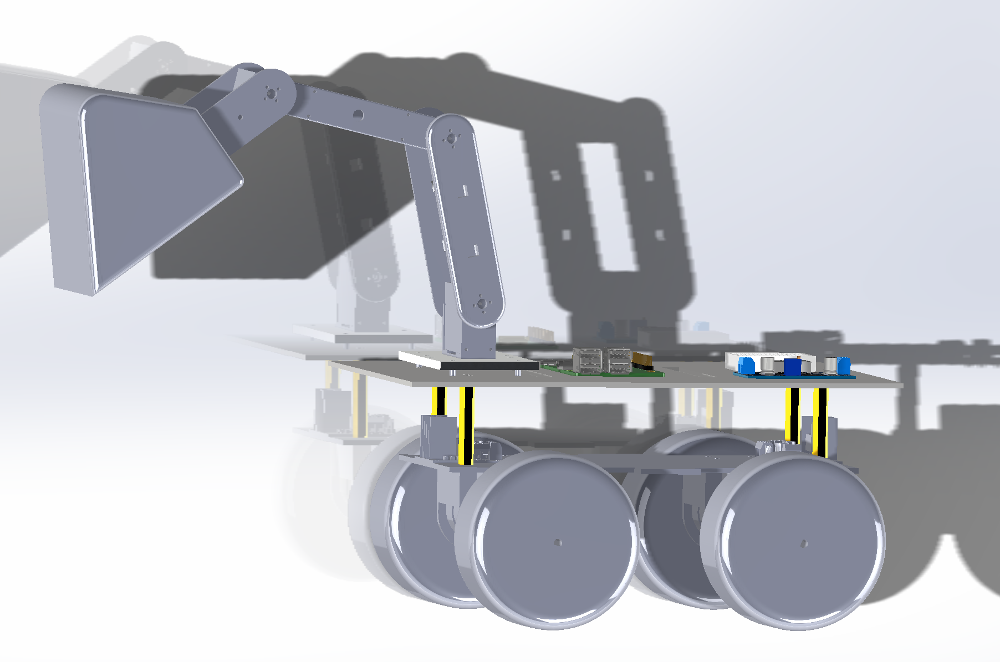
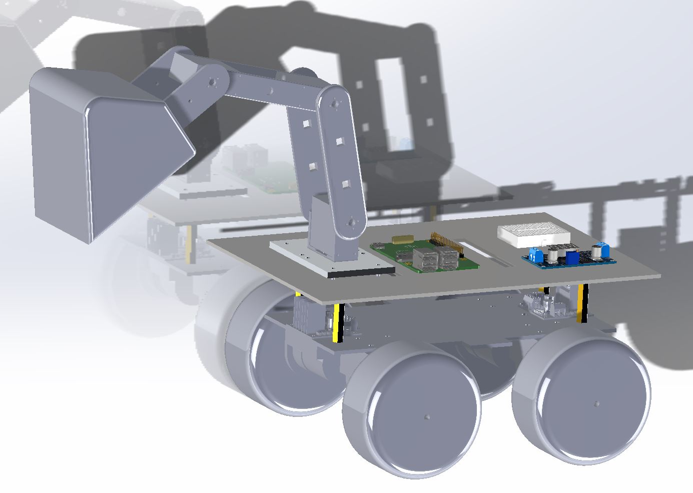
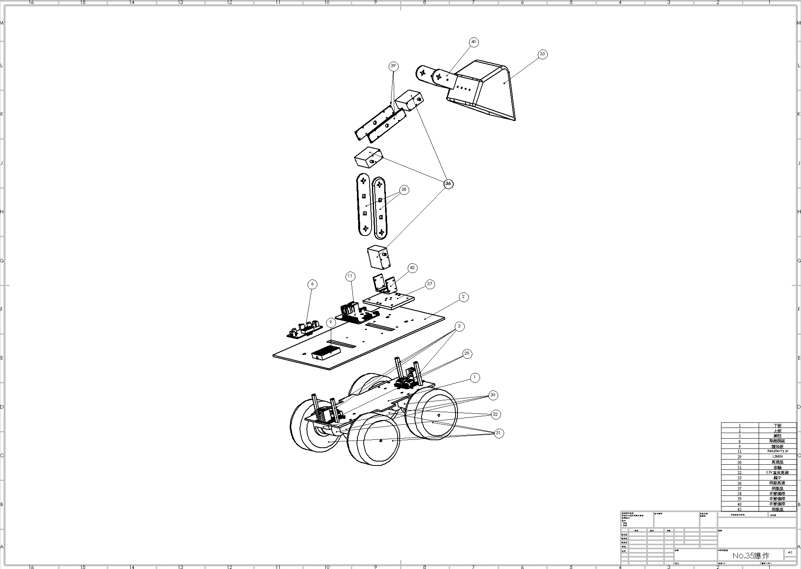
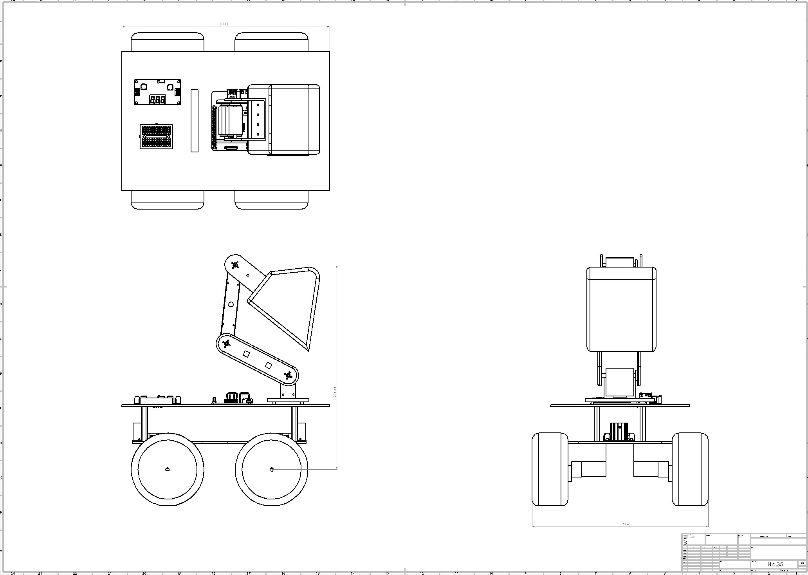

# Radio-controlled-Car
> This repo is for my course ` Mechanical system design and practice` in NTUST.<br>
> The topic of competition is *極速快遞*.
---
<p align="center">

</p>
<p align="center">Design on Solidworks.</p> 

<p align="center">

</p>
<p align="center">Design on Solidworks.</p>

<p align="center">

</p>
<p align="center">exploded view</p>

<p align="center">

</p>
<p align="center">Three view drawing</p>

## Install

```
pip3 install pyPS4Controller
pip3 install RPi.GPIO
pip3 install cv2
pip3 install numpy
pip3 install time
```

